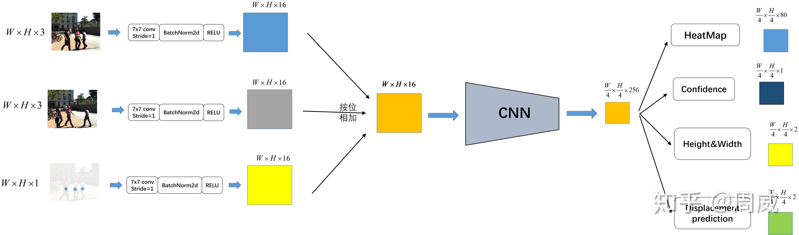

# CenterTrack笔记



- [模型推理](#模型推理)
  - [计算pre\_img和pre\_hm](#计算pre_img和pre_hm)
- [LOSS](#loss)
  - [损失函数定义](#损失函数定义)
- [参考](#参考)


## 模型推理

```python
def forward(self, x, pre_img=None, pre_hm=None):
    if (pre_hm is not None) or (pre_img is not None):
    # 此处一共有三个输入，分别是本次特征，上次特征，以及上次heatmap
    feats = self.imgpre2feats(x, pre_img, pre_hm)  
    else:
    feats = self.img2feats(x)
    out = []
    if self.opt.model_output_list:
    for s in range(self.num_stacks):
        z = []
        for head in sorted(self.heads):
            z.append(self.__getattr__(head)(feats[s]))
        out.append(z)
    else:
    for s in range(self.num_stacks):
        z = {}
        for head in self.heads:
            z[head] = self.__getattr__(head)(feats[s])
        out.append(z)
    return out
```

从上述代码可以看出，**前向推理有三个输入：`x`, `pre_img`, `pre_hm`**

`x`很好理解，就是本次img。

继续分析`pre_img`和`pre_hm`如何获取。

### 计算pre_img和pre_hm

在`src/lib/dataset/generic_dataset.py`的 `def __getitem__(self, index)`函数中，有如下代码：

```python
...
...
pre_cts, track_ids = None, None
if opt.tracking:
    # 获取pre信息
    pre_image, pre_anns, frame_dist = self._load_pre_data(
    img_info['video_id'], img_info['frame_id'], 
    img_info['sensor_id'] if 'sensor_id' in img_info else 1)
    if flipped:
    pre_image = pre_image[:, ::-1, :].copy()
    pre_anns = self._flip_anns(pre_anns, width)
    if opt.same_aug_pre and frame_dist != 0:
    trans_input_pre = trans_input 
    trans_output_pre = trans_output
    else:
    c_pre, aug_s_pre, _ = self._get_aug_param(
        c, s, width, height, disturb=True)
    s_pre = s * aug_s_pre
    trans_input_pre = get_affine_transform(
        c_pre, s_pre, rot, [opt.input_w, opt.input_h])
    trans_output_pre = get_affine_transform(
        c_pre, s_pre, rot, [opt.output_w, opt.output_h])
    pre_img = self._get_input(pre_image, trans_input_pre)
    pre_hm, pre_cts, track_ids = self._get_pre_dets(
    pre_anns, trans_input_pre, trans_output_pre)
    ret['pre_img'] = pre_img
    if opt.pre_hm:
    ret['pre_hm'] = pre_hm
...
...
```

继续分析`_load_pre_data`：
```python
def _load_pre_data(self, video_id, frame_id, sensor_id=1):
    img_infos = self.video_to_images[video_id]
    # If training, random sample nearby frames as the "previoud" frame
    # If testing, get the exact prevous frame
    if 'train' in self.split:
        img_ids = [(img_info['id'], img_info['frame_id']) \
            for img_info in img_infos \
            if abs(img_info['frame_id'] - frame_id) < self.opt.max_frame_dist and \
            (not ('sensor_id' in img_info) or img_info['sensor_id'] == sensor_id)]
    else:
        img_ids = [(img_info['id'], img_info['frame_id']) \
            for img_info in img_infos \
            if (img_info['frame_id'] - frame_id) == -1 and \
            (not ('sensor_id' in img_info) or img_info['sensor_id'] == sensor_id)]
        if len(img_ids) == 0:
        img_ids = [(img_info['id'], img_info['frame_id']) \
            for img_info in img_infos \
            if (img_info['frame_id'] - frame_id) == 0 and \
            (not ('sensor_id' in img_info) or img_info['sensor_id'] == sensor_id)]
    rand_id = np.random.choice(len(img_ids))
    img_id, pre_frame_id = img_ids[rand_id]
    frame_dist = abs(frame_id - pre_frame_id)
    img, anns, _, _ = self._load_image_anns(img_id, self.coco, self.img_dir)
    return img, anns, frame_dist
```

这里比较有意思的部分是，在训练过程中，<font color=red>**pre_image并非严格意义上的“前”，而是在允许范围内的n帧中随机挑一帧作为pre_image**</font>。
```python
if 'train' in self.split:
    img_ids = [(img_info['id'], img_info['frame_id']) \
        for img_info in img_infos \
        if abs(img_info['frame_id'] - frame_id) < self.opt.max_frame_dist and \
        (not ('sensor_id' in img_info) or img_info['sensor_id'] == sensor_id)]

...
rand_id = np.random.choice(len(img_ids))
img_id, pre_frame_id = img_ids[rand_id]
...
```

**但是在验证阶段的话，是需要严格按照时间序列的前后关系**。

获取到对应图像pre_image后，通过如下方式计算得到pre_img和pre_hm：
```python
# 计算并得到pre_img和pre_hm
pre_img = self._get_input(pre_image, trans_input_pre)
pre_hm, pre_cts, track_ids = self._get_pre_dets(
pre_anns, trans_input_pre, trans_output_pre)
ret['pre_img'] = pre_img
if opt.pre_hm:
ret['pre_hm'] = pre_hm
```


## LOSS

### 损失函数定义

`src/lib/trainer.py`中定义：

```python
class Trainer(object):
  def __init__(
    self, opt, model, optimizer=None):
    self.opt = opt
    self.optimizer = optimizer
    self.loss_stats, self.loss = self._get_losses(opt) # 定义各类损失函数
    self.model_with_loss = ModleWithLoss(model, self.loss) # 定义模型与损失函数，后续forward就是通过model_with_loss调用
```

```python
def _get_losses(self, opt):
    loss_order = ['hm', 'wh', 'reg', 'ltrb', 'hps', 'hm_hp', \
        'hp_offset', 'dep', 'dim', 'rot', 'amodel_offset', \
        'ltrb_amodal', 'tracking', 'nuscenes_att', 'velocity']
    loss_states = ['tot'] + [k for k in loss_order if k in opt.heads]
    loss = GenericLoss(opt)
    return loss_states, loss

...
...

class GenericLoss(torch.nn.Module):
  def __init__(self, opt):
    super(GenericLoss, self).__init__()
    self.crit = FastFocalLoss(opt=opt) 
    self.crit_reg = RegWeightedL1Loss()
    if 'rot' in opt.heads:
      self.crit_rot = BinRotLoss()
    if 'nuscenes_att' in opt.heads:
      self.crit_nuscenes_att = WeightedBCELoss()
    self.opt = opt
```

损失函数有以下几类：`self.crit`、`self.crit_reg`、`self.crit_rot`、`self.crit_nuscenes_att`。

```python
def forward(self, outputs, batch):
    opt = self.opt
    losses = {head: 0 for head in opt.heads}

    for s in range(opt.num_stacks):
      output = outputs[s]
      output = self._sigmoid_output(output)

      if 'hm' in output:
        # FastFocalLoss
        losses['hm'] += self.crit(
          output['hm'], batch['hm'], batch['ind'], 
          batch['mask'], batch['cat']) / opt.num_stacks
      
      regression_heads = [
        'reg', 'wh', 'tracking', 'ltrb', 'ltrb_amodal', 'hps', 
        'dep', 'dim', 'amodel_offset', 'velocity']

      for head in regression_heads:
        if head in output:
        # RegWeightedL1Loss
          losses[head] += self.crit_reg(
            output[head], batch[head + '_mask'],
            batch['ind'], batch[head]) / opt.num_stacks
      
      if 'hm_hp' in output:
        # FastFocalLoss
        losses['hm_hp'] += self.crit(
          output['hm_hp'], batch['hm_hp'], batch['hp_ind'], 
          batch['hm_hp_mask'], batch['joint']) / opt.num_stacks
        if 'hp_offset' in output:
          # RegWeightedL1Loss
          losses['hp_offset'] += self.crit_reg(
            output['hp_offset'], batch['hp_offset_mask'],
            batch['hp_ind'], batch['hp_offset']) / opt.num_stacks
        
      if 'rot' in output:
        # BinRotLoss
        losses['rot'] += self.crit_rot(
          output['rot'], batch['rot_mask'], batch['ind'], batch['rotbin'],
          batch['rotres']) / opt.num_stacks

      if 'nuscenes_att' in output:
        # WeightedBCELoss
        losses['nuscenes_att'] += self.crit_nuscenes_att(
          output['nuscenes_att'], batch['nuscenes_att_mask'],
          batch['ind'], batch['nuscenes_att']) / opt.num_stacks

```

## 参考
[CenterTrack深度解析](https://zhuanlan.zhihu.com/p/252813609)